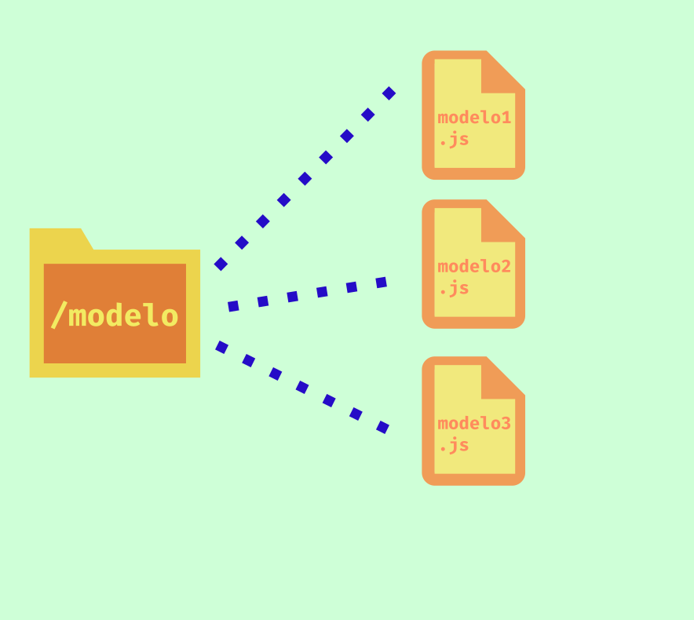

# Modelo Mongoose
A partir de arquivos `.js` é possível definir modelos de dados baseados em objetos javascript e criar as "tabelas" no banco de dados Mongodb no qual são denominadas Schemas.

Uma vez definidas, a própria biblioteca Mongoose permite configuração de comunicação com a aplicação Node.js, e realizar as operações de inserção, alteração, remoção e busca dos documentos inseridos no banco de dados.