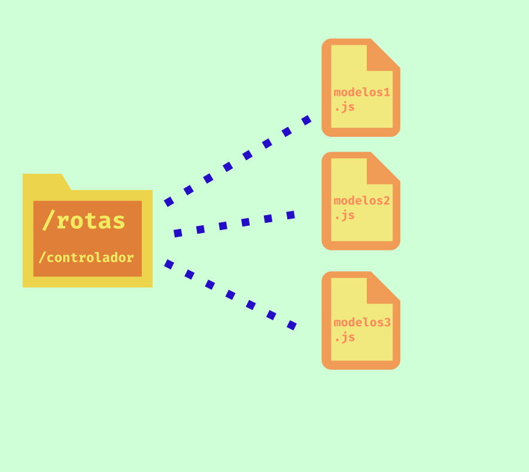

# Controladora Express
a biblioteca Express permite a construção da aplicação em Node.js para ser utilizada na web, e para realizar tal tarefa ele comunica com a biblioteca de visão EJS e a partir de seus arquivos na pasta de rotas, definem o tratamento de dados vindo da visão que se tornarão objetos javascript para manipular no banco de dados.

